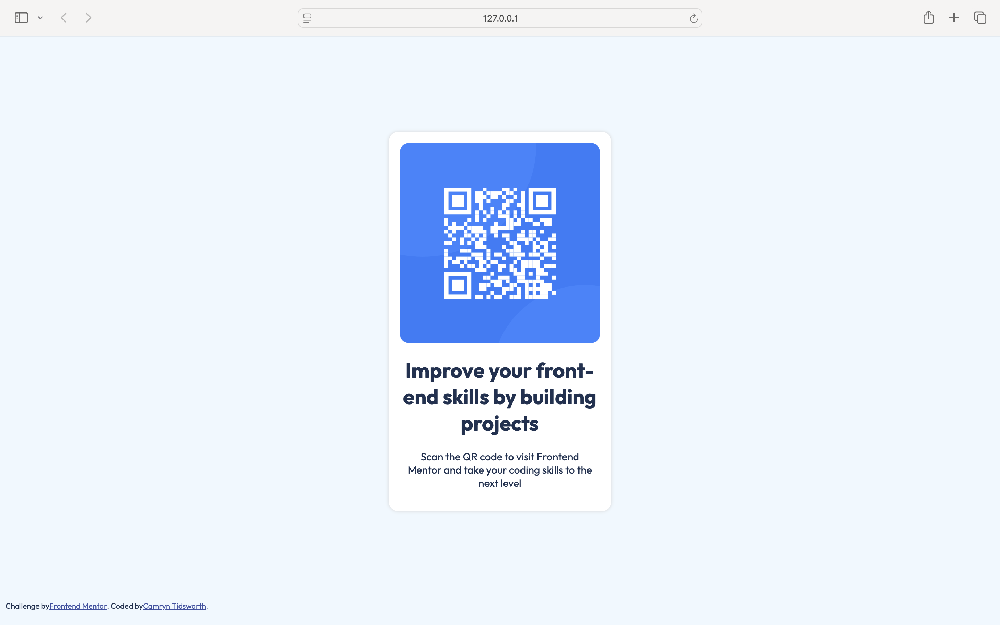

# Frontend Mentor - QR code component solution

This is a solution to the [QR code component challenge on Frontend Mentor](https://www.frontendmentor.io/challenges/qr-code-component-iux_sIO_H). Frontend Mentor challenges help you improve your coding skills by building realistic projects. 

## Table of contents

- [Overview](#overview)
  - [Screenshot](#screenshot)
  - [Links](#links)
- [My process](#my-process)
  - [Built with](#built-with)
  - [What I learned](#what-i-learned)
  - [Continued development](#continued-development)
- [Author](#author)

## Overview

### Screenshot

### Links

- Live Site URL: [here](https://camryntidsworth.github.io/QR-code-component/)

## My process

### Built with

- HTML5
- CSS
- Flexbox

### What I learned

The main aim of this project was to get an introduction to Frontend Mentor. I focused on setting up and utilizing GitHub with VS Code, building out a pre-designed project, and getting comfortable with Frontend Mentor's workflow. While the project itself is very simple, it did offer a short and sweet opportunity to practice flexbox and CSS positioning properties. 

### Continued development

In future projects, I'd like to continue to hone my skills with flexbox and other positioning properties in CSS. 

## Author

- Frontend Mentor - [@CamrynTidsworth](https://www.frontendmentor.io/profile/CamrynTidsworth)
